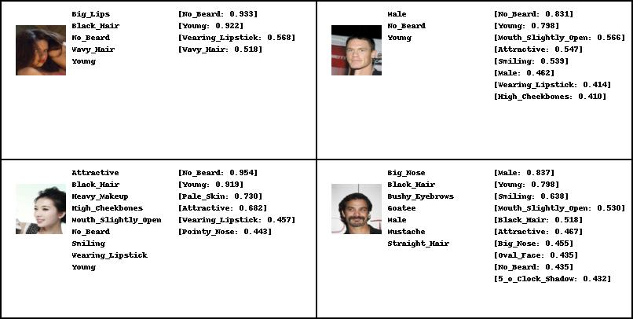

# SCAN
This is a pytorch reproduction of the paper:
[SCAN: Learning Hierarchical Compositional Visual Concepts, Higgins et al., ICLR 2018]

This implementation is based on the [implementation][Github Repo] of β-VAE.
The β-VAE model used here, however, is modified to utilize another DAE as reconstruction loss provider according to the paper.

### Dependencies
```
python 3.6
pytorch 0.4
visdom
numpy
```

### Datasets
[same with here]

### Usage
To initialize visdom:

    vidsom -port 6059

To reproduce the results of SCAN, you can sequentially run the three `.sh` files:

    sh scripts/DAE.sh
    sh scripts/beta_VAE.sh
    sh scripts/SCAN.sh

By default, the working environment setting is `/data/hc/SCAN/` in `main.py` `--root_dir`, which should be modified for your convenience.
This is directory is supposed to contain the dataset in `root_dir/dataset/`, and is where checkpoint files and output files will be saved.

The original β-VAE models are still supported, and examples of result reproducing commands can be found in `scripts/original-beta_VAE/`


### Selected Results

To view results in full detail, please go to [this file](results/Results_in_detail.md) of `results/Results_in_detail.md`.

#### reconstruction
Left part: original images. Right part: reconstructed images based on description.


#### img2sym
In every card, columns shown from left to right are: 1. original image, 2. labels, 3. top predicted labels and probabilities.


#### sym2img
Attributes other than the appointed ones are randomly sampled within {0, 1}.


#### traversal
Traversal range is -3 ~ 3.


### Note

There is some sort of self-contradiction in the paper.

1. The reconstruction loss of β-VAE is said to be the square difference of only the DAE encoder net in its Section 4, but in Appendix A.1 the loss is said to be between "the pixel space of DAE reconstructions".
This is mentioned in the [issue][this issue] above, too.
In the code, I applied only the DAE encoder net.

2. Under equation(4) of the paper, the authors mentioned "to up-weight the forward KL term relative to the other terms in the cost function (e.g. λ = 1, β = 10)", which seems to be self-contradicting.
In the code, I adopted the setting in Appendix A.1, which is λ = 10, β = 1.

Up to now, I haven't implemented the recombination operator part.
This is partly because of lack of time, and partly because I mainly reproduced the CelebA experiment, in which the paper didn't show the results of the recombination part, either.

I will try to implement this operator later, if necessary and time permitting.
However, I guess the preformance will not be satisfying, because the results of SCAN net on the CelebA dataset is already non-significant (which I guess is due to either the complexity of face data or the imperfectness of my code).

### Acknowledgement:

I've referred to [this issue][], and adopted its solution which is to use the DAE output rather than to improve the visuality of β-VAE.

### Reference
1. [SCAN: Learning Hierarchical Compositional Visual Concepts, Higgins et al., ICLR 2018]
2. [Github Repo]: Pytorch implementation of β-VAE from [1Konny](https://github.com/1Konny)

[SCAN: Learning Hierarchical Compositional Visual Concepts, Higgins et al., ICLR 2018]: https://arxiv.org/abs/1707.03389
[Github Repo]: https://github.com/1Konny/Beta-VAE 
[same with here]: https://github.com/1Konny/FactorVAE 
[this issue]: https://github.com/miyosuda/scan/issues/1
